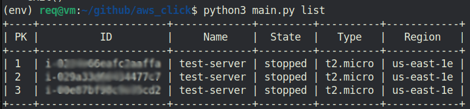
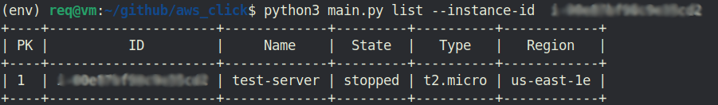
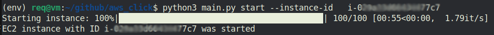
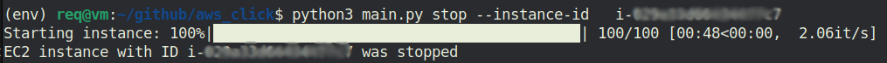
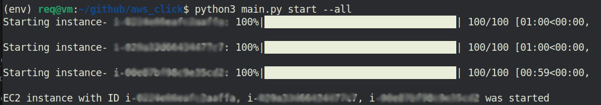
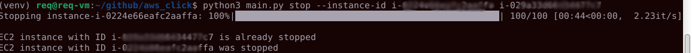

## CLI tool in Python3 to manage ec2 instances on Amazon Web Services

### Installation instructions:
Clone the repository using the following command:
```
git clone https://github.com/Sashamxz/aws_click.git
```

Navigate to the project directory:
```
cd aws_click
```

Create and activate a virtual environment:
```
python3 -m venv venv

source venv/bin/activate   - for Linux;

venv\Scripts\activate.bat  - for Windows;
```

Install the dependencies listed in the requirements.txt file:
```
pip install -r requirements.txt
```

Add '.env' file in main folder with your data:
```
ACCESS_KEY_ID = 'your key id'
SECRET_ACCESS_KEY = 'your access key'
REGION = 'aws ec2 region'
```

### Usage:
remark:

**instance_id** - it is unique identification for ec2 instance

instance_id example ->  i-0114e46wafc2baffq  


there two args for a start or stop command:

```
--instance-id    #for select some instance(s) 

--all            #for select all instances 

Dont use the --all and --instance-id parameter together!
```

To get a list of instances with information about each instance 
use the following command:

For show list of all instances:
```
python3 main.py list  

```

 

If you need information only about some, run this command with --instance-id:
```
python3 main.py list  --instance-id your_instance_id
```

 

Start an instance by ID:

```
python3 main.py start --instance-id your_instance_id

```




For a stop instance by ID :

```
python3 main.py stop --instance-id your_instance_id

```

 


Also, you can use it to stop or start a few IDs:
```
python3 main.py stop --instance-id id1 id3
```

If you want to start or to stop **all** instances use **--all** options:

```
python3 main.py start --all
```
 

If you use the start or stop command for a few IDs and one of them is already started or 
stopped , a message about this will appear:

```
 python3 main.py stop --instance-id id1 id2
```



### Error Handling:

The following is a list of possible errors and their meanings:

First of all, if you get an error that starts with **"Connection error"**:
```
-check your internet connection

-check if you entered the id , key and region aws access correctly 

-check error text, which can help you fix the error
```
Connection error headers:

**AccessDeniedException**     -   This error occurs when there are missing or insufficient EC2 access rights.

**InvalidSignatureException** -   This error occurs when the request signature is not valid.

**ClientError**               -   This error occurs when there is an interaction error with the EC2 service.

**EndpointConnectionError**   -   This error occurs when a connection to the EC2 server cannot be established.

**NoCredentialsError**        -   This error occurs when access keys and secret keys are missing.


#### Errors that may appear when working with instances:
_________________________________________________________________________________________________
*No EC2 instance found*       : Indicates that there are no EC2 instances available in the account.
_________________________________________________________________________________________________
*No EC2 instance ID provided* : Indicates that an EC2 instance ID was not provided.
_________________________________________________________________________________________________
*EC2 instance with ID {instance_id} 
is already running*           : Indicates that the specified EC2 instance is already in a running state.
_________________________________________________________________________________________________
*EC2 instance with ID {instance_id}
 is already stopped*          : Indicates that the specified EC2 instance is already in a stopped state.
_________________________________________________________________________________________________
*User does not have sufficient 
permissions to start or stop the instance(s)*   : Check your permissions maybe you need access.
_________________________________________________________________________________________________
*No instances available for starting/stipping*  :  All instance is already  started/stopped.


### References:
[boto3 documentation](https://boto3.amazonaws.com/v1/documentation/api/latest/index.html)

[boto3  article with best explanations](https://unbiased-coder.com/boto3-ec2-create-launch-stop/)

[aws api](https://docs.aws.amazon.com/AWSEC2/latest/APIReference/API_ModifyInstanceAttribute.html)

[github boto3](https://github.com/boto/boto3)

[boto3 code example](https://boto3.amazonaws.com/v1/documentation/api/latest/guide/ec2-example-managing-instances.html)

[argparse documentation with exapmle](https://docs.python.org/3/library/argparse.html)

[prettytable documentation](https://pypi.org/project/prettytable/)

[tqdm documentation](https://tqdm.github.io/docs/tqdm/)

[also I have used stackoveflow](https://stackoverflow.com/questions/42809096/difference-in-boto3-between-resource-client-and-session)

[for readme](https://markdown.rozh2sch.org.ua/#%D0%BF%D1%83%D1%82%D1%96%D0%B2%D0%BD%D0%B8%D0%BA-%D0%BF%D0%BE-markdown)

also I founded  answers in other forums
